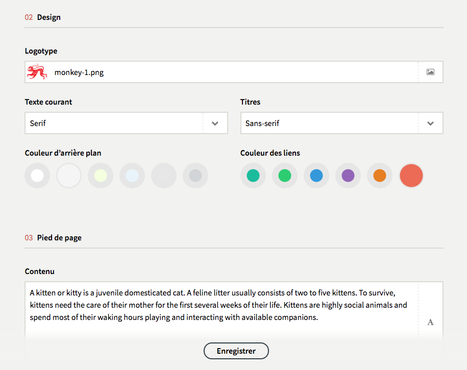
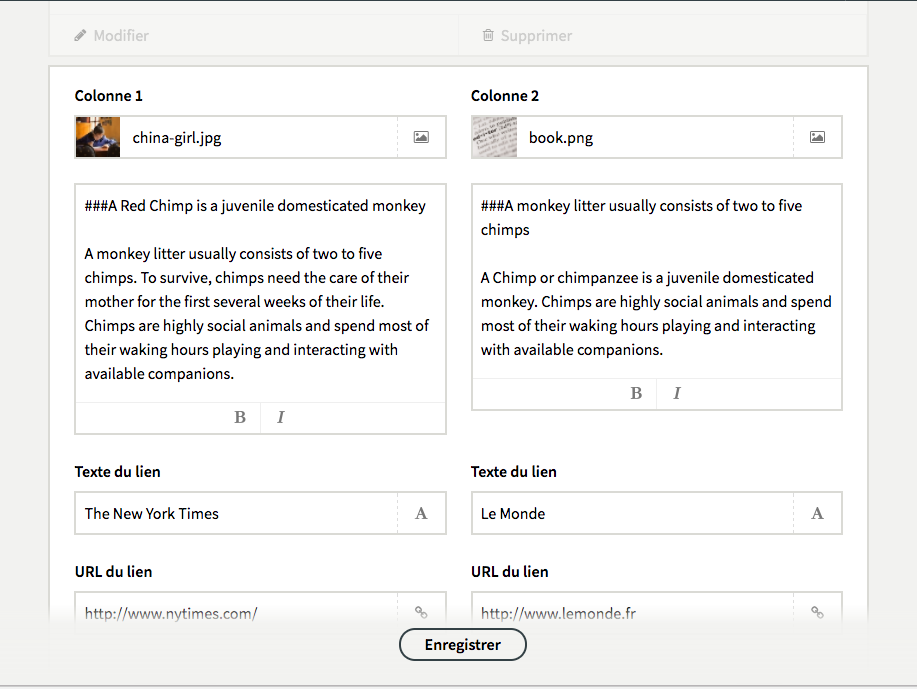
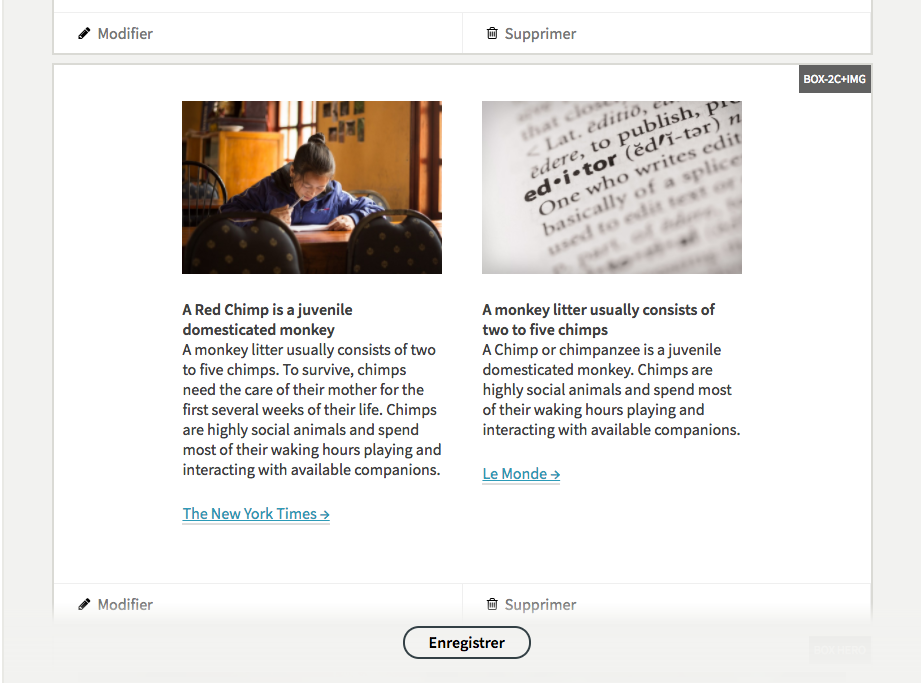

# Red Chimp

A modular newsletter “template” for Kirby CMS

## Presentation

The purpose of **Red Chimp** is to create an usable interface to configure and compose a newsletter using the Kirby CMS and Kirby Panel.

The newsletter configuration is done using the native blueprints form fields system of the [Kirby Panel](https://getkirby.com/docs/panel/blueprints) and the [Kirby Color List](https://github.com/Thiousi/kirby-color-list) plugin, developed by Mathieu Etienne, for custom colors selection.

The editing dispositive is build on the [Builder Field](https://github.com/TimOetting/kirby-builder) extension, developed by Tim Ötting, for managing the content organized in “boxes”.

The templates produce a responsive HTML email, based on a derivative of “modular patterns markup” of the [Email Bluprints](https://github.com/mailchimp/email-blueprints) developed by MailChimp.

No demo, but two screen captures : [desktop](doc/images/screencapture-red-chimp-mail.png) email view and [mobile](doc/images/screencapture-red-chimp-mobile.png) email view.

## License

- Red Chimp – [The MIT License (MIT)](doc/license.txt)
- Email Blueprints – [Creative Commons Attribution-ShareAlike 3.0 Unported License](http://creativecommons.org/licenses/by-sa/3.0/)
- Builder Field  – The MIT License (MIT)
- Kirby Color List – The MIT License (MIT)
